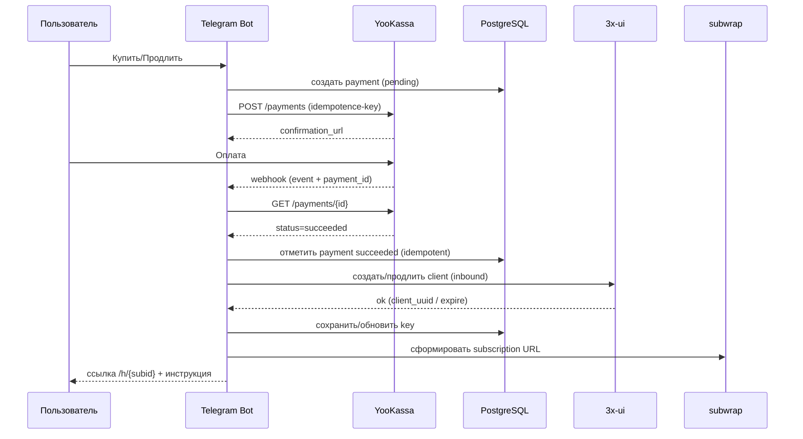

# Архитектура

## Компоненты
### 1) Telegram Bot (aiogram v3)
- UI: команды / кнопки / callback
- бизнес-логика: создание/продление ключей, выдача ссылок
- поднимает локальные HTTP endpoints (если включено): например webhook YooKassa

Код: `app/tg/*`, `app/services/*`

### 2) PostgreSQL + SQLAlchemy + Alembic
- хранит пользователей, ключи, платежи (если таблица платежей уже добавлена)
- миграции в `alembic/*`

### 3) 3x-ui (Xray)
- бот логинится в панель и управляет client’ами в inbound’е
- операции: create / extend / delete

Код: `app/adapters/xui.py`

### 4) subwrap
- собирает subscription по `sub_id` (обертка над конфигом)
- даёт публичную ссылку, которую можно импортировать в клиент

Код: `app/adapters/subwrap.py`

### 5) Happ redirect page
Отдельная страница `/h/{subid}`, которая:
- показывает кнопку подключения
- формирует deep-link `happ://add/<subscription-url>`

Код: `happ_redirect.py` (aiohttp)

### 6) YooKassa
- бот создаёт платеж (API)
- после оплаты YooKassa шлёт уведомление на webhook
- бот проверяет платеж через API и выполняет действие (create/extend)

## Поток “создать/продлить” (схема)

## Порты (по докам проекта)
- subwrap health: `127.0.0.1:8090`
- YooKassa webhook (локально): `127.0.0.1:8091`
- Happ redirect (локально): `127.0.0.1:18080`

Публичный доступ обычно делается через Cloudflare Tunnel / reverse proxy.
